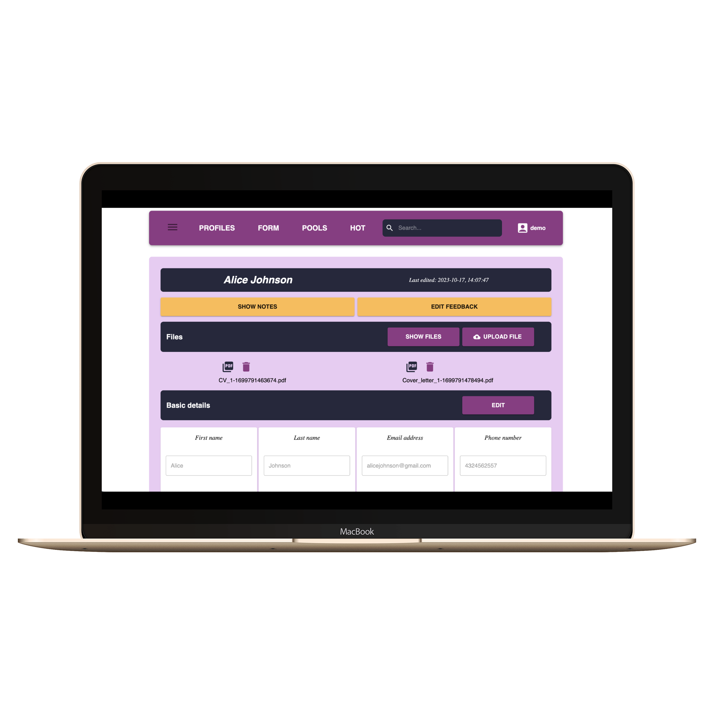
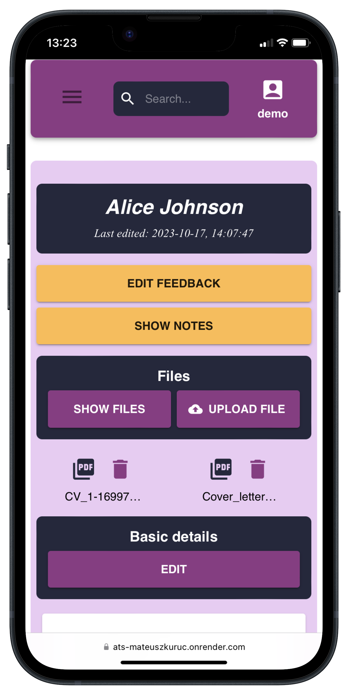
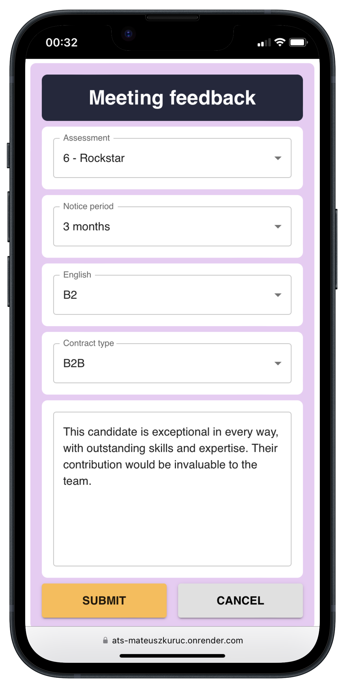
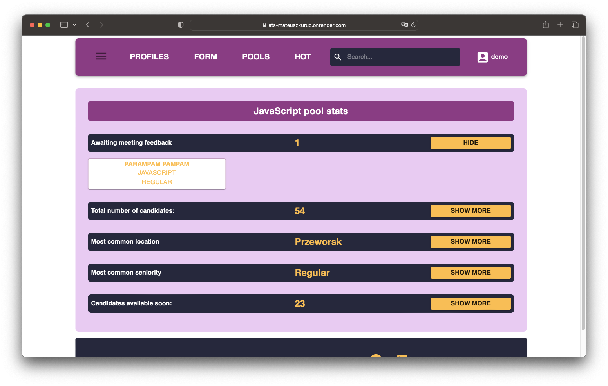
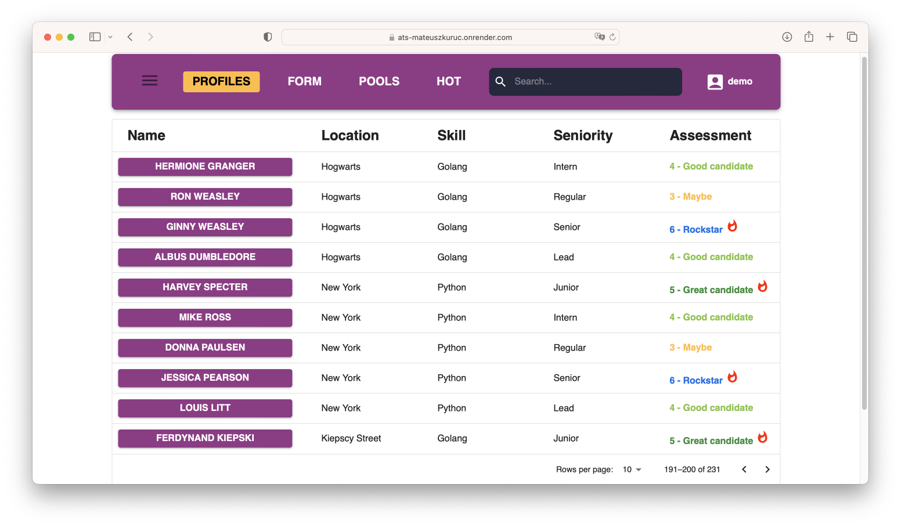
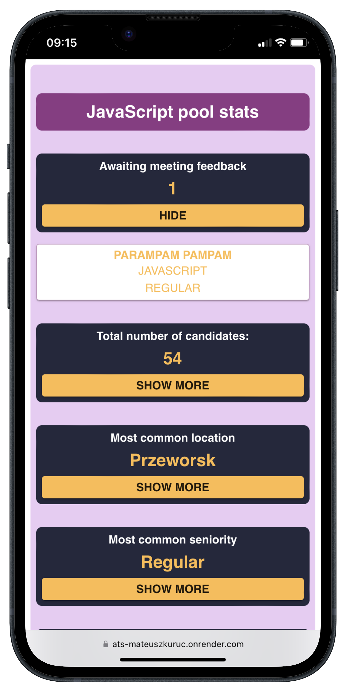

# ATS-recruitment-app

The goal is to develop full fledged Applicant Tracking System (ATS) app for recruiters, streamlining the pipeline management. This is a full stack app based on modern tools like React, Node.js, AWS cloud, MongoDB and related technologies.

Since <b>I work as IT Recruiter</b> myself, the idea to build complex pipeline management system came to me naturally, allowing me to combine all the knowledge I have about industry to present my variation of a convenient ATS.

This is by far the biggest project I have worked on and I am excited about sharing the final results.

🌐 [ATS app live](https://ats-mateuszkuruc.onrender.com/)

<h2>Goals</h2>

The app allows a recruiter to better organise the recruitment process and make it more transparent. ATS is a valuable tool in the recruiter's arsenal, allowing intuitive data storage, feedback management and status control. The application was designed specifically with IT sector recruitment in mind. It is reflected in the field types of the candidate profile, technologies in pools section and job titles.

Each user only has restricted access to his own candidate database, allowing them to perform CRUD actions on all the profiles. The user can also display pipeline data in various tables, apply filtering or sorting, and check the statistics based on the candidate's background.

For me, as the author of the app, the additional goal was to use <b>all the knowledge I acquired over months of study AND THEN SOME</b>. I wanted to push my React and Redux knowledge to the limits for the efficient state management and build solid backend with Node.js and Express that will communicate with frontend.

Then I needed to introduce the key to the whole project - <b>database</b>. I opted for MongoDB with Mongoose as I have already worked with these tools. On top of that, I learned basic of cloud solutions and implemented <b>AWS S3</b>service to handle file management.

  
<h2>Technologies</h2>
    
  
    

  

<h2>Key features</h2>
<ul>
  <li>Login with token-based authentication (JWT)</li>
  <li>Add candidate profile with basic data through "New profile form" with validation (name, e-mail, phone number, seniority, location, field)</li>
  <li>Update candidate profile with <b>extended feedback</b> (notice period, language level, contract type, assessment)</li>
  <li>Update any of the fields in candidate profile if needed</li>
  <li>Delete candidate profile</li>
  <li>Display all profiles in tables, allowing the user to <b>sort and filter</b>, and change number of rows per page</li>
  <li>Access recruitment statistics per specialization ("Pools" tab), show most common seniority and location for each skillset, show reminder for missing feedback</li>
  
</ul>

<h2>App design and problem solving</h2>
<ul>
  <li>
    All candidate data is stored in MongoDB with Mongoose schemas declared, while the files (e.g. resumes) uploaded to the profile are stored in AWS S3. Each candidate profile entry in MongoDB has got reference to the link for AWS download, upload or delete actions. 
  </li>
  <li>React on the frontend is used for <b>reusable components</b>, state management and defining project structure
  <li>Redux Toolkit used to handle state management in store throughout app with reducers defined by createSlice</li>
  <li>React Router used for defining app routes</li>
  <li>Node.js with Express on the backend facilitate communication between frontend, server and databases (MongoDB and AWS). Multer used to simplify file management</li>
  <li>Only logged users can access data and make changes, added local storage to restore token for users who had already been logged in</li>
  <li>Token-based authentication implemented - each request needs token in the headers, otherwise the action is rejected on the backend</li>
  <li>Material UI and Styled components are used to create cohesive and user-friendly interface</li>
  <li>Fully responsive design, the app looks and works well on all screen sizes (which was demanding due to sheer amount of data displayed in some tabs)
  <li>Timed notifications with success/error/info status are displayed on each user action to communicate that changes were made</li>
  <li>Deployment of backend and frontend parts separately was made to Render</li>
</ul>
 

Each recruiter's data (meaning the data of their applicants, too) is only available to themselves, as the app provides data based on currently logged in user. This means that candidate's details will only be shown to the user who added them to the database, thus restraining app users from sharing sensitive data of others by the means of ATS app.

<h2>Visual representation</h2>

  
  
   
  
  
   
  
  

<h2>ATS Code repositories</h2>

The code for backend and frontend parts can be found in separate repositories below:

🌐 [ATS Backend code](https://github.com/MateuszKuruc/ATS-recruitment-app/tree/main/ats-backend)

🌐 [ATS Frontend code](https://github.com/MateuszKuruc/ATS-recruitment-app/tree/main/ats-frontend)

In case of any questions, feel free to contact me directly.
